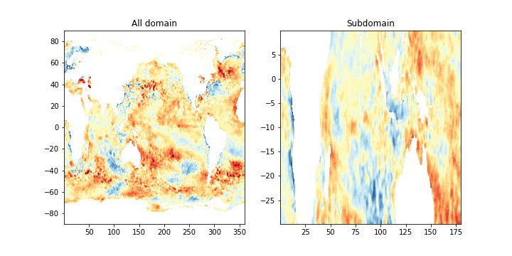

## Publications

---
### 2021

---
### 2020

**Prigent**, A., Imbol Koungue, R. A., Lübbecke, J. F., Brandt, P., & Latif, M. (2020). [Origin of weakened interannual sea surface temperature variability in the southeastern tropical Atlantic Ocean.](https://doi.org/10.1029/2020GL089348) Geophysical Research Letters, 47, e2020GL089348. https://doi.org/10.1029/2020GL089348

**Prigent**, A., Lübbecke, J.F., Bayr, T., Latif M., Wengel C.,[Weakened SST variability in the tropical Atlantic Ocean since 2000](https://doi.org/10.1007/s00382-020-05138-0) . Clim Dyn 54, 2731–2744 (2020). https://doi.org/10.1007/s00382-020-05138-0

---

## Python module
[Artools](https://github.com/aprig/Artools)

 ---
